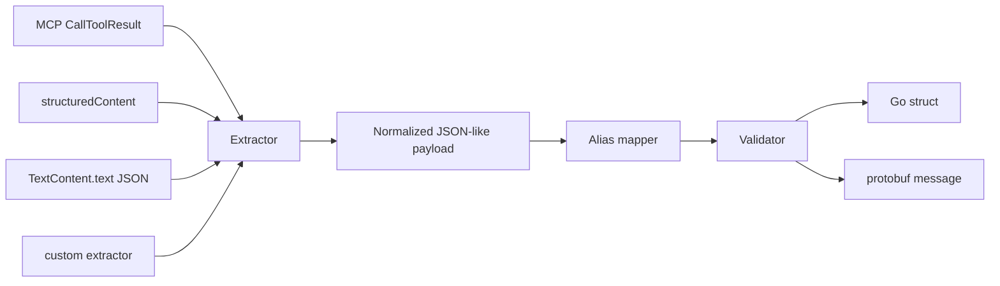

# mcp-proto-bridge

`mcp-proto-bridge` converts MCP tool responses into strongly typed Go structs and protobuf messages.

It is built for Go services that already use protobuf and gRPC internally, but need to consume AI capabilities exposed by Python, TypeScript, or other MCP servers without writing one-off JSON parsing and mapping code in every service.

## Why This Exists

MCP tool results can contain structured data in `structuredContent`, but many real MCP servers and SDKs return the useful payload as JSON inside `TextContent.text`.

That leaves Go microservices doing the same glue work repeatedly:

- find the actual payload
- parse JSON from text when needed
- rename fields such as `id` to `order_id`
- reject tool errors from `isError`
- validate required fields
- decode into protobuf response contracts

This library makes that path boring and repeatable.

## Problem It Solves

`mcp-proto-bridge` removes repetitive and error-prone MCP payload glue code in Go services by standardizing:

- payload extraction from `structuredContent` and text JSON
- alias mapping between model-friendly fields and contract fields
- strict/lenient decode behavior with clear errors
- required field validation and typed decode into structs or protobuf

## Complements gRPC-to-MCP Tooling

Tools such as `protoc-gen-go-mcp` help expose gRPC services as MCP servers.

`mcp-proto-bridge` solves the reverse direction:

```text
MCP tool response -> typed Go/protobuf response -> internal gRPC-native service
```

## Architecture



## Quickstart

```go
package main

import (
	"log"

	"github.com/akshayshahce/mcp-proto-bridge/generated/orderpb"
	"github.com/akshayshahce/mcp-proto-bridge/pkg/bridge"
	"github.com/akshayshahce/mcp-proto-bridge/pkg/types"
)

func main() {
	result := &types.CallToolResult{
		Content: []types.ContentBlock{
			types.TextContent{Text: `{"order_id":"ORD-123","status":"confirmed","amount":50}`},
		},
	}

	var response orderpb.CreateOrderResponse
	if err := bridge.DecodeProto(result, &response, bridge.WithStrictMode(true)); err != nil {
		log.Fatal(err)
	}
}
```

## Example Usage

Use this library when a service consumes MCP tool output and needs a typed protobuf contract before business logic:

```go
result, err := mcpClient.FetchToolResult()
if err != nil {
	log.Fatal(err)
}

var rec recommendationpb.RecommendationResponse
if err := bridge.DecodeProto(result, &rec, bridge.WithStrictMode(true)); err != nil {
	log.Fatal(err)
}

applyPricing(rec)
```

See complete runnable examples in `examples/`.

## Practical Microservice Flow

Real service-style flow is provided in [`examples/practical_microservice_flow`](examples/practical_microservice_flow):

```text
service1 (MCP provider) -> MCP CallToolResult -> mcp-proto-bridge -> service2 typed protobuf logic
```

It includes:

- real MCP server provider (`service1_mcp_provider`)
- consumer service that decodes with `bridge.DecodeProto` (`service2_consumer`)
- both text JSON and structuredContent tool-output paths

## Struct Decode

```go
type CreateOrderResponse struct {
	OrderID string  `json:"order_id" bridge:"required"`
	Status  string  `json:"status" bridge:"required"`
	Amount  float64 `json:"amount"`
}

var response CreateOrderResponse
err := bridge.Decode(result, &response)
```

## Protobuf Decode

```go
var response orderpb.RecommendationResponse
err := bridge.DecodeProto(result, &response, bridge.WithStrictMode(true))
```

The decoder uses `protojson`, so protobuf JSON names and field names are handled the same way Go protobuf users expect.

## Field Aliases

MCP tools often return model-friendly field names that differ from protobuf contracts. Aliases map source fields to target fields before decoding.

```go
err := bridge.DecodeProto(
	result,
	&response,
	bridge.WithFieldAliases(map[string]string{
		"id":    "order_id",
		"state": "status",
	}),
)
```

Alias conflict policy is deterministic:

- if both a source key and its target key are present, the explicit target key wins
- if multiple source keys map to the same target key, the first source key in sorted key order wins

## MCP Response Shapes Supported In v1

Supported:

- `structuredContent` as a JSON object
- `TextContent.text` containing a JSON object
- `TextContent.text` containing a JSON array
- `TextContent.text` containing embedded JSON (for example fenced markdown JSON) when `WithJSONIndentDetection(true)`
- multiple content blocks where one text block contains JSON
- malformed JSON-looking text blocks followed by later valid JSON text blocks
- malformed/non-object `structuredContent` fallback to text decoding
- malformed/unknown content blocks preserved as raw blocks without aborting full result unmarshal
- local MCP-like types for SDK-neutral integration
- custom extractor hooks

Not supported in v1:

- streaming tool responses
- image/audio/resource decoding
- full MCP server or transport gateway behavior
- schema registry integration

## Why Not Just Parse JSON Manually?

Manual parsing works for one service and one tool. It gets expensive when a company has 100+ Go microservices and a growing set of MCP-backed AI services.

This library centralizes the parts that become easy to get subtly wrong:

- consistent `isError` handling
- fallback from `structuredContent` to JSON text
- strict versus lenient unknown field behavior
- aliases for contract-friendly names
- required field validation
- protobuf decoding with clear errors

## How This Helps In 100+ Go Microservice Environments

Teams can keep their internal contracts stable while experimenting with MCP servers owned by AI, data science, or platform teams. Each service gets a small adapter at the edge:

```text
MCP client call -> bridge.DecodeProto -> existing gRPC response type
```

That keeps business logic typed, testable, and consistent with the rest of the Go service fleet.

## API Reference

```go
func Decode(result *types.CallToolResult, out any, opts ...bridge.Option) error
func DecodeAs[T any](result *types.CallToolResult, opts ...bridge.Option) (T, error)
func DecodeProto(result *types.CallToolResult, out proto.Message, opts ...bridge.Option) error
```

Options:

- `WithFieldAliases(map[string]string)`
- `WithPreferStructuredContent(bool)`
- `WithStrictMode(bool)`
- `WithAllowUnknownFields(bool)`
- `WithCustomExtractor(extractor.Extractor)`
- `WithJSONIndentDetection(bool)`
- `WithTargetName(string)`
- `WithHooks(observe.Hooks)`
- `WithSafetyLimits(bridge.SafetyLimits)`
- `WithProfile(bridge.Profile)`
- `WithDecodePolicy(bridge.DecodePolicy)`
- `WithVersionRules(bridge.VersionRules)`
- `WithDriftRules(bridge.DriftRules)`
- `WithAdaptiveRouting(bridge.AdaptiveRouting)`
- `WithAutoRepair(bridge.AutoRepair)`
- `WithRuntimeCounters(bridge.RuntimeCounters)`

Detailed behavior contracts are documented in:

- [`docs/api_behavior_matrix.md`](docs/api_behavior_matrix.md)
- [`docs/operational_readiness.md`](docs/operational_readiness.md)
- [`docs/production_readiness_checklist.md`](docs/production_readiness_checklist.md)
- [`docs/branch_protection_setup.md`](docs/branch_protection_setup.md)
- [`docs/release_checklist.md`](docs/release_checklist.md)

Community and contribution docs:

- [`CONTRIBUTING.md`](CONTRIBUTING.md)
- [`CODE_OF_CONDUCT.md`](CODE_OF_CONDUCT.md)
- [`SECURITY.md`](SECURITY.md)

Output argument contract:

- `Decode` requires a non-nil pointer output
- `DecodeProto` requires a non-nil protobuf message output (typed-nil pointers are rejected)

Custom extractor fallback contract:

- when using `extractor.CompositeExtractor`, wrapped soft-stop errors continue fallback to the next extractor:
	- `ErrNoStructuredPayload`
	- `ErrUnsupportedContentType`
	- `ErrInvalidJSONTextContent`

Errors:

- `ErrToolReturnedError`
- `ErrNoStructuredPayload`
- `ErrInvalidJSONTextContent`
- `ErrUnsupportedContentType` when no usable text JSON payload is found and unsupported non-text content blocks were encountered
- `ErrValidationFailed`
- `ErrFieldMappingFailed`

Use `errors.Is` to check error categories.

## Examples

- [`examples/basic_struct_decode`](examples/basic_struct_decode)
- [`examples/protobuf_decode`](examples/protobuf_decode)
- [`examples/grpc_handler_usage`](examples/grpc_handler_usage)
- [`examples/practical_microservice_flow`](examples/practical_microservice_flow)
- [`examples/operational_readiness`](examples/operational_readiness)
- [`cmd/demo`](cmd/demo)

## Protobufs

Example protobuf contracts live in [`proto`](proto). Generated-style Go files are checked into [`generated`](generated) so examples and tests can run immediately.

To regenerate in a normal Go/protobuf environment:

```sh
make proto
```

## How To Run Locally

```sh
go mod download
make test
make demo
```

Useful targets:

```sh
make fmt
make lint
make proto
```

## Real Python MCP Integration Test

The repository includes an integration fixture in [`integration/python_mcp`](integration/python_mcp) that starts a real Python MCP server over stdio, calls it with the MCP Python SDK client, captures the actual `CallToolResult` JSON, and then verifies that the Go bridge decodes it.

Run it with:

```sh
make integration-test
```

The target is idempotent. It creates `integration/python_mcp/.venv`, installs the Python MCP SDK from `requirements.txt`, writes the captured SDK response to `integration/python_mcp/out/real_mcp_response.json`, and runs:

```sh
go test ./tests -tags=integration -v
```

The integration test covers a scenario matrix with real Python MCP responses:

- direct text JSON payload
- embedded JSON inside text content (decoded with `WithJSONIndentDetection(true)`)
- malformed JSON-like text block followed by later valid JSON block
- malformed `structuredContent` with fallback to valid text payload

## Limitations

`mcp-proto-bridge` intentionally focuses on enterprise decoding of practical MCP tool results. It does not implement MCP transports, servers, streaming, content negotiation, or every MCP content type.

Strict mode currently relies on JSON/protobuf decoder unknown-field checks. Required field validation for plain structs uses `bridge:"required"` or `validate:"required"` tags.

## Roadmap

- reverse conversion: protobuf message to MCP tool result content
- gRPC interceptors and handler helpers
- streaming/tool progress support
- schema registry integration
- generated mappers for hot paths
- richer validation configuration
- summary text generation helper for reverse direction

## License

MIT
