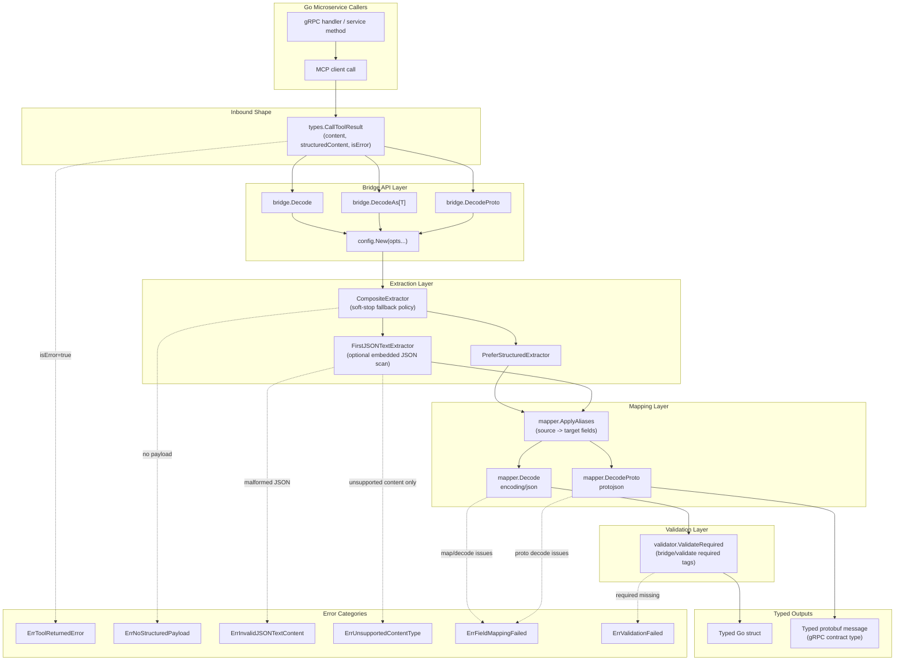

# MCP Proto Bridge: Architecture and Design Dig-In

This document is a deep technical walkthrough of how the repository actually works today.
It is intended for Go backend and platform engineers deciding whether to standardize on this library in a gRPC-first microservice ecosystem.

## System Diagram

## 1) Product Intent and Current Scope

The library sits at the service boundary and converts MCP tool responses into strongly typed models used by Go services:

MCP response -> extractor -> normalized payload -> mapper -> validator -> Go struct or protobuf message

Current scope is intentionally narrow and practical:

- decode MCP-like CallToolResult values
- support structuredContent object payloads
- support JSON payloads embedded in text content
- decode into plain Go structs
- decode into protobuf messages
- provide strict/lenient unknown field handling
- provide required field validation for tagged fields

Out of scope:

- MCP transport/server implementation
- streaming/progress decoding
- non-JSON content decoding (image/audio/resource)

## 2) Core Package Responsibilities

### pkg/bridge

Public API facade and orchestration.

Key exported functions:

- Decode(result, out, opts...)
- DecodeAs[T](result, opts...)
- DecodeProto(result, out, opts...)

Bridge responsibilities:

- build Config from options
- reject tool errors via isError
- choose extractor chain by preference
- route normalized payload to mapper

### pkg/config

Central option model.

Notable options:

- WithPreferStructuredContent
- WithStrictMode
- WithAllowUnknownFields
- WithFieldAliases
- WithCustomExtractor
- WithJSONIndentDetection
- WithTargetName

Strict mode forces unknown-field rejection.

### pkg/types

SDK-neutral MCP-like types and custom JSON unmarshal logic.

Important design choices:

- Content block polymorphism via ContentBlock interface
- known text blocks decode to TextContent
- unknown block types preserved as RawContent
- structuredContent decoding is tolerant: non-object/malformed structuredContent is ignored so text fallback can still work

### pkg/extractor

Finds and parses payload candidates from CallToolResult.

Built-ins:

- PreferStructuredExtractor
- FirstJSONTextExtractor
- CompositeExtractor

Extractor semantics:

- text extractor scans blocks in order
- malformed JSON-looking blocks are accumulated and skipped
- later valid JSON still succeeds
- if no valid payload exists, accumulated parse error is returned (if present)
- composite extractor treats certain sentinel categories as soft-stop and continues fallback

Soft-stop categories in current implementation:

- ErrNoStructuredPayload
- ErrUnsupportedContentType
- ErrInvalidJSONTextContent

### pkg/mapper

Maps normalized payload into target model.

Key steps:

1. ApplyAliases recursively
2. resolve alias conflicts deterministically (explicit target key wins; multi-source collisions are deterministic)
3. marshal normalized payload to JSON
4. decode into struct (encoding/json) or proto (protojson)
5. run required validator for struct decode path

### pkg/validator

Post-decode required field validation for struct models.

Supported traversal now includes:

- pointers
- structs
- slices
- arrays
- maps
- interface-wrapped values

Required tags recognized:

- bridge:"required"
- validate:"required"

## 3) End-to-End Execution Flows

### Decode (struct path)

1. bridge.Decode constructs config
2. extractPayload selects extractor chain
3. extractor returns normalized payload (map/array/primitive)
4. mapper.ApplyAliases rewrites keys recursively
5. mapper decodes to target struct
6. validator enforces required tags

### DecodeProto (protobuf path)

1. bridge.DecodeProto constructs config
2. payload extraction same as struct path
3. mapper.ApplyAliases rewrites keys
4. protojson.Unmarshal decodes into proto message
5. unknown field behavior controlled by strict mode / allowUnknown

### DecodeAs[T]

Ergonomic generic wrapper over Decode.

Behavior:

- T is non-pointer: decode into &out and return out
- T is pointer: allocate pointed value, decode directly, return non-nil pointer on success

## 4) Error Contract and Handling Strategy

Sentinel categories are defined in pkg/errors:

- ErrToolReturnedError
- ErrNoStructuredPayload
- ErrInvalidJSONTextContent
- ErrUnsupportedContentType
- ErrValidationFailed
- ErrFieldMappingFailed

Practical guidance:

- callers should use errors.Is for category checks
- detailed context is preserved by wrapping with formatted messages

Examples:

- malformed JSON in text block -> ErrInvalidJSONTextContent with content index details
- tool-level failure (isError=true) -> ErrToolReturnedError with summary text if available
- required field missing -> ErrValidationFailed with field path

## 5) StructuredContent vs Text Fallback Policy

Default extraction order is configurable:

- prefer structured first (default)
- or prefer text first

Design outcome:

- valid structuredContent can still be used even when earlier text extraction emits soft-stop errors
- malformed text blocks do not force immediate failure while scanning
- unsupported non-text blocks only become terminal when no fallback source can satisfy decoding

## 6) JSON Indent Detection

WithJSONIndentDetection now controls whether text extraction scans for embedded JSON in mixed text.

When enabled:

- text like markdown fenced snippets can be parsed if an object/array is embedded

When disabled:

- only text beginning with { or [ is considered

This is useful for MCP tools that return explanatory text plus JSON payload blocks.

## 7) API Ergonomics for Service Teams

Strengths:

- one-call decode APIs for structs and protobufs
- option-driven strictness and aliases
- generic DecodeAs convenience for typed return

Operational safeguards:

- Decode rejects non-pointer output and nil pointer output explicitly
- DecodeProto rejects nil/typed-nil proto outputs explicitly

Team usage pattern in handlers:

1. call MCP tool
2. pass result to DecodeProto
3. return existing protobuf contract from service logic

This keeps MCP integration at the edge and business logic on typed contracts.

## 8) Test Evidence Mapping

### Unit tests (tests/bridge_test.go)

Coverage includes:

- structuredContent success
- text JSON success
- DecodeAs struct/pointer/pointer-to-pointer paths
- required field failures
- malformed text scanning and fallback
- strict unknown field rejection (struct and proto)
- unsupported content handling
- custom extractor wrapped-sentinel fallback
- embedded JSON detection on/off behavior
- malformed structuredContent fallback to text
- deep nested slice required validation
- explicit API misuse rejection for non-pointer outputs

### Integration test (tests/integration_real_mcp_test.go)

Real Python MCP fixture validates:

- true SDK-generated CallToolResult payload
- direct text JSON shape
- embedded JSON text shape (markdown/fenced block)
- malformed JSON-like text followed by later valid JSON
- malformed `structuredContent` with text fallback
- successful decode into struct and protobuf targets

This is strong evidence that the bridge works against non-Go MCP implementations.

## 9) Design Trade-Offs

1. Tolerant structuredContent parsing
- pro: resilient to malformed/non-object structuredContent, allows text fallback
- con: malformed structuredContent is ignored rather than surfaced directly

2. Soft-stop extractor categories
- pro: robust fallback behavior across extractor chain
- con: custom extractor authors must align with sentinel categories

3. Validator model
- pro: lightweight, no heavy external validation dependencies
- con: focused on required semantics only, not full schema/rule validation

## 10) Practical Adoption Guidance

Good fit when:

- services already speak protobuf internally
- MCP responses vary between structuredContent and text JSON
- teams want a common edge adapter instead of ad-hoc parsing

Adoption checklist:

1. standardize strict mode defaults per org policy
2. define alias maps near contract boundaries
3. use errors.Is category handling in handlers
4. add service-specific decode tests around critical tools
5. keep MCP response adaptation confined to edge layer

## 11) Suggested Internal Standards for Platform Teams

- require DecodeProto for RPC-facing responses
- require WithStrictMode(true) unless a tool has known extra fields
- require required tags on contract-critical struct decode paths
- require table-driven tests for each MCP tool contract
- require custom extractors to wrap sentinel errors when enabling fallback

## 12) What This Repo Is and Is Not

What it is:

- a concrete MCP-to-typed-contract bridge for Go services
- a reusable decoding boundary to reduce glue code duplication

What it is not:

- a full MCP runtime or transport layer
- a schema registry or policy engine
- a replacement for domain validation/business rules

## 13) Quick Code Landmarks

- Public API: pkg/bridge/bridge.go
- Options/config: pkg/config/config.go
- MCP types/unmarshal: pkg/types/types.go
- Payload extraction: pkg/extractor/extractor.go
- Mapping/proto decode: pkg/mapper/mapper.go
- Required validation: pkg/validator/validator.go
- Unit tests: tests/bridge_test.go
- Real MCP integration test: tests/integration_real_mcp_test.go
- Python MCP fixture: integration/python_mcp

## 14) Summary

This repository implements a focused and pragmatic boundary layer for decoding MCP responses into typed Go/protobuf models. The architecture is intentionally small, test-backed, and suitable for standardization in gRPC-first environments where MCP tools are introduced at service edges.

Its strongest value is reducing repeated parsing/mapping/validation glue across many services while preserving typed contracts and clear error categories.