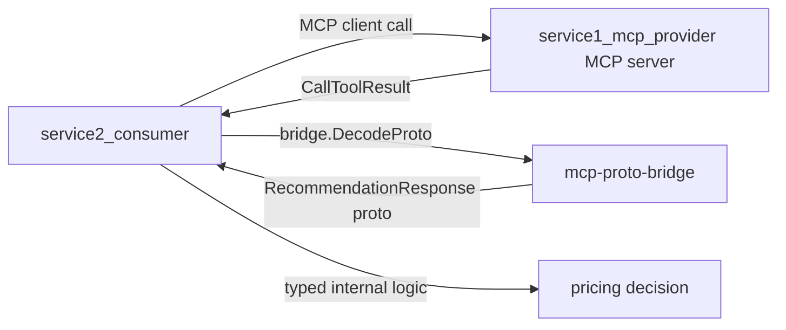

# Practical Microservice Flow: real MCP server -> bridge -> service2

This example demonstrates a realistic microservice-style pattern for using `mcp-proto-bridge`.

## What this demonstrates

- `service1_mcp_provider` is a real MCP server exposing tool methods.
- `service2_consumer` uses an MCP client path to call service1 tools.
- `mcp-proto-bridge` converts MCP response data into a typed protobuf contract.
- service2 then uses typed protobuf fields in normal internal pricing logic.

No manual JSON parsing is performed in service2.

## Architecture



## Why this matters in real microservices

In larger gRPC-first environments, AI/MCP providers return MCP tool payloads (often text-wrapped JSON). This pattern keeps conversion in one standard place and lets consumers work with normal typed protobuf contracts.

## Folder overview

- [examples/practical_microservice_flow/proto/recommendation.proto](examples/practical_microservice_flow/proto/recommendation.proto): protobuf contract used by service2
- [examples/practical_microservice_flow/generated/recommendationpb/recommendation.pb.go](examples/practical_microservice_flow/generated/recommendationpb/recommendation.pb.go): generated Go protobuf types
- [examples/practical_microservice_flow/service1_mcp_provider/server.py](examples/practical_microservice_flow/service1_mcp_provider/server.py): real MCP server with tool handlers
- [examples/practical_microservice_flow/shared/mcpclient/capture.py](examples/practical_microservice_flow/shared/mcpclient/capture.py): MCP client helper that calls service1 tools and returns CallToolResult JSON
- [examples/practical_microservice_flow/shared/mcpclient/client.go](examples/practical_microservice_flow/shared/mcpclient/client.go): Go wrapper that invokes the MCP client helper
- [examples/practical_microservice_flow/service2_consumer/main.go](examples/practical_microservice_flow/service2_consumer/main.go): consumer service using bridge + typed proto
- [examples/practical_microservice_flow/scripts/run.sh](examples/practical_microservice_flow/scripts/run.sh): convenience script to run both services
- [examples/practical_microservice_flow/requirements.txt](examples/practical_microservice_flow/requirements.txt): Python dependency for MCP server/client

## Run locally

From repository root, run:

```sh
bash ./examples/practical_microservice_flow/scripts/run.sh
```

The script creates a local Python venv, installs MCP dependencies, then runs `service2_consumer`, which calls the real MCP server tools through the MCP client helper.

## Expected output

`service2_consumer` runs two flows:

1. `mode=text`: MCP tool returns JSON inside `TextContent.text`
2. `mode=structured`: MCP tool returns `structuredContent`

Example logs:

```text
mode=text campaign=spring_sale confidence=0.92 discount=10%
mode=text original=120.00 final=108.00
mode=structured campaign=spring_sale confidence=0.92 discount=10%
mode=structured original=120.00 final=108.00
```

## Where MCP response is produced

- Real MCP tool handlers produce `CallToolResult` in [examples/practical_microservice_flow/service1_mcp_provider/server.py](examples/practical_microservice_flow/service1_mcp_provider/server.py).

## Where protobuf conversion happens

- `service2_consumer` calls `bridge.DecodeProto(...)` in [examples/practical_microservice_flow/service2_consumer/main.go](examples/practical_microservice_flow/service2_consumer/main.go).

## Where typed protobuf is consumed

- service2 reads `RecommendationResponse` fields and performs pricing calculations in [examples/practical_microservice_flow/service2_consumer/main.go](examples/practical_microservice_flow/service2_consumer/main.go).

## Summary

This example demonstrates the exact intended enterprise pattern with a real MCP server:

`service1 MCP output -> mcp-proto-bridge -> service2 typed protobuf usage`

It shows clear service boundaries, realistic data flow, and direct business value from removing per-service parsing glue.
